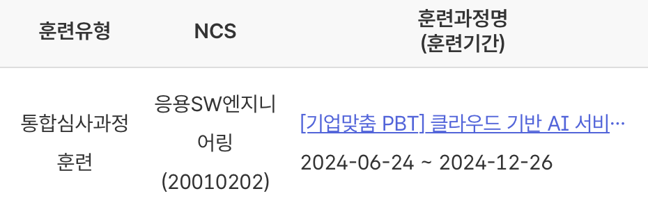

# 📌 김진수 GitHub Portfolio

안녕하세요! 👋 저는 **김진수**입니다.  
소프트웨어 개발, 웹 애플리케이션 구축 및 문제 해결에 열정을 가진 개발자입니다.  
끊임없이 배우고 성장하며, 새로운 기술에 도전하는 것을 두려워하지 않습니다.  
이 포트폴리오는 제가 작업한 프로젝트, 실습 내용, 기술 스택, 그리고 달성한 성과를 통해 저의 개발 여정을 소개합니다.

---

## 🌟 About Me

- 🎓 **학력**: 영진전문대학 ICT반도체전자계열 졸업
- 💼 **경력**: 신입
- 🌱 **학습 중인 기술**: Spring Boot, AWS, React, Docker
- 💬 **관심사**: Web Development, Back-End Development, Cloud Computing
- 🌐 **블로그**: [Tistory 블로그](https://myinfo503.tistory.com)

## 💡 개발 철학

"효율적이고 확장 가능한 코드를 작성하여 사람들의 삶을 더 편리하게 만드는 것을 목표로 삼고 있습니다. 이를 위해 항상 문제의 본질을 이해하고 최적의 해결책을 제시할 수 있는 개발자가 되기를 지향합니다.  

React와 Spring Boot를 활용하여 프론트엔드와 백엔드 간의 통합적인 구조를 설계하고, AWS와 같은 클라우드 서비스를 통해 확장성과 안정성을 갖춘 애플리케이션을 구현합니다. 이러한 경험을 바탕으로, 사용자의 요구를 반영하는 직관적이고 강력한 시스템을 만들어가고자 합니다.  

또한, **Spring Security**를 활용한 보안 로직 구현과 **JPA**를 사용한 데이터베이스 관리를 통해 안정적인 데이터 처리를 중요하게 생각합니다. 효율적인 코드를 작성하는 것은 물론, 팀원들과의 원활한 소통을 통해 협업의 시너지를 극대화하고, 더 나아가 함께 성장하는 환경을 만들어내는 것이 제 개발 철학의 핵심입니다.  

끊임없이 변화하는 기술 트렌드 속에서도 학습을 멈추지 않고, 새로운 도구와 프레임워크를 배우며 기존의 한계를 극복하고자 합니다. 이러한 끊임없는 학습과 도전 정신은 제가 더 나은 개발자가 되는 원동력이 됩니다.  

결론적으로, 저는 기술과 사람을 연결하는 도구로서의 소프트웨어 개발을 중요하게 여기며, 이를 통해 더 많은 사람들에게 가치를 제공하고자 합니다."

---

## 📝 훈련 과정

자세한 훈련 과정은 [훈련과정](./훈련과정.md) 에서 확인할 수 있습니다.

---
## 💼 Projects

### 1. [React-SpringBoot-Board](https://github.com/KimuJinsu/react-springboot-board)
- **설명**: React와 Spring Boot를 활용한 게시판 애플리케이션입니다.  
  사용자 계정 관리, 게시글 작성/관리, 파일 업로드, 태그 기반 검색 및 AWS S3 파일 저장소 연동을 포함합니다.
- **기술 스택**: Spring Boot, React, JPA, AWS S3, SMTP, Gradle
- **성과**: 사용자 인증과 게시판 CRUD를 완벽히 구현하며, 실시간 데이터 전송 및 클라우드 파일 저장을 성공적으로 연동.

### 2. [Embedded-Tomcat-App-Board](https://github.com/KimuJinsu/embedded-tomcat-board-app)
- **설명**: Spring Framework와 JPA를 사용하여 내장 Tomcat을 활용한 게시판 애플리케이션입니다.
- **기술 스택**: Spring Framework, JPA, Embedded Tomcat, MySQL
- **성과**: 내장 서버를 활용해 배포 속도를 개선하고, 데이터베이스와의 안정적인 연동을 통해 효율적인 데이터 처리를 구현.

### 3. [HTML-CSS-Javascript-Calculator](https://github.com/KimuJinsu/html-css-javascript-calculator)
- **설명**: HTML, CSS, JavaScript를 사용하여 간단한 계산기 애플리케이션을 구현하였습니다.  
  16진수(HEX)와 10진수(DEC) 간의 변환도 지원합니다.
- **기술 스택**: HTML, CSS, JavaScript
- **성과**: JavaScript의 기본 로직을 이해하고, 사용자 친화적인 UI를 설계.

---

## 📚 Study Projects

아래는 학습 목적으로 진행한 프로젝트들로, 주요 기술과 개념을 실습하며 습득한 내용들입니다:

- [Database Practice](https://github.com/KimuJinsu/database-practice): 데이터베이스 모델링 및 SQL 쿼리 실습을 통해 데이터 구조 이해.
- [Git Practice](https://github.com/KimuJinsu/git-practice): Git 명령어와 버전 관리 전략을 학습.
- [Reflection Practice](https://github.com/KimuJinsu/reflection-practice): Java Reflection API를 활용하여 동적 프로그래밍을 실습.
- [Spring AOP Practice](https://github.com/KimuJinsu/spring-aop-practice): AOP를 통해 로깅 및 트랜잭션 관리 기법을 익힘.
- [Instrumentation API Practice](https://github.com/KimuJinsu/instrumentation-api): JVM의 Instrumentation API 활용.
- [JPA Practice](https://github.com/KimuJinsu/jpa-practice): 엔티티 매핑 및 CRUD 작업 실습.
- [Spring Framework Practice](https://github.com/KimuJinsu/spring-framework-practice): 토비의 스프링을 기반으로 Spring Framework 6 버전을 활용.
- [Design Pattern Practice](https://github.com/KimuJinsu/designpattern-practice): 디자인 패턴을 활용한 객체지향 설계 학습.
- [Spring Boot Board Practice](https://github.com/KimuJinsu/springboot-board-practice): Spring Boot 기반 게시판 기능 구현.
- [Spring Web MVC Test App Practice](https://github.com/KimuJinsu/spring-web-mvc-test-app): MVC 구조 설계와 컨트롤러 테스트.
- [Spring Security Practice](https://github.com/KimuJinsu/spring-security-practice): Spring Security를 활용한 인증 및 인가 학습.
- [Spring Security JWT Practice](https://github.com/KimuJinsu/spring-security-jwt): JWT 기반 보안 시스템 설계.
- [Taco Cloud with Kafka and ActiveMQ](https://github.com/KimuJinsu/tacocloud-with-kafka-and-activemq): Spring Boot와 Kafka, ActiveMQ를 활용하여 메시징 기반의 웹 애플리케이션 구현.
- [AWS S3 Demo](https://github.com/KimuJinsu/aws-s3-demo): Spring Boot와 AWS S3를 사용하여 파일 업로드, 이미지 관리, 파일 삭제 기능을 구현.

---

## 🛠️ Technical Skills

### **📌 프로그래밍 언어**

### **📌 웹 기술**

### **📌 도구 및 플랫폼**

### **📌 데이터베이스**

### **📌 빌드 도구**

### **📌 네트워크 지식**

### **📌 기타 기술**

---

## 📧 Contact Me

- 📞 **Mobile**: 010-5651-8828
- 📫 **Email**: [jinsu8828@gmail.com](mailto:jinsu8828@gmail.com)
- 💻 **GitHub**: [김진수 GitHub](https://github.com/KimuJinsu)
